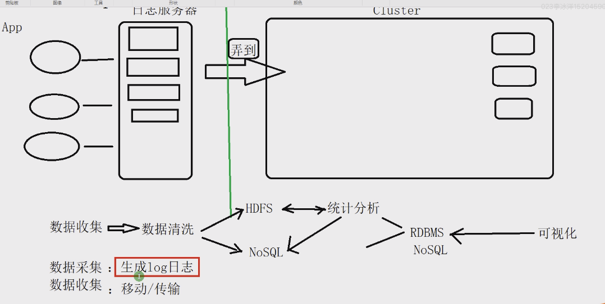

# Flume01-入门

Flume 主要是做数据搬运工作



## 背景

> 从日志服务器传输log日志至少可以用-put，但是存在很多问题


> 简单来说


## Flume三个核心组件

- Source		对接数据源	A
  - avro	序列化框架	**四颗星！！！**
  - exec    执行shell
  - Spooling Directory
  - Taildir Source		**五颗星重要！！！**		
  - Kafka
  - nc
  - http
  - Custom

- Channel	聚集 缓冲		解耦

  Source 和 Sink 之间的一个缓冲区

  - memory
  - file
  - kafka
  - jdbc

- Sink			对接目的地	B
  - HDFS
  - logger    测试
  - avro   					**四颗星！！！**
  - kafka						**五颗星！！！**
  - Custom

## Flume的配置文件

```# example.conf: A single-node Flume configuration

a1: Agent的名字

需求：监听localhost机器的44444端口，接收到数据sink到终端

# Name the components on this agent   配置各种名字
a1.sources = r1  配置source的名字
a1.sinks = k1    配置sink的名字
a1.channels = c1  配置channel的名字

# Describe/configure the source       配置source的基本属性
a1.sources.r1.type = netcat
a1.sources.r1.bind = localhost
a1.sources.r1.port = 44444


# Use a channel which buffers events in memory  配置channel的基本属性
a1.channels.c1.type = memory


# Describe the sink                  配置sink的基本属性
a1.sinks.k1.type = logger


# Bind the source and sink to the channel      连线
a1.sources.r1.channels = c1
a1.sinks.k1.channel = c1
```

###### 部署flume

上传flume安装包到虚拟机

root权限下更改文件所属组

```
[root@centos-linux-7 software]# chown hadoop:hadoop flume-ng-1.6.0-cdh5.16.2.tar.gz -R
```

再切换回hadoop用户

```
su - hadoop
```

把flume解压到app目录

==配置环境变量==

配置$FLUME_HOME/conf/flume-env.sh

```
export JAVA_HOME=/usr/....
```

在$FLUME_HOME/config目录下配置example.conf

 [example.conf](../../Downloads/若泽大数据/班课/12-Flume01/资料/example.conf) 

配置~/.bashrc

```
# flume env
export FLUME_HOME=/home/hadoop/app/flume...
export PATH=${FLUME_HOME}/bin:$PATH

验证环境变量是否配置成攻
flume-ng version
Flume 1.6.0
```

用flume-ng命令配置

```
flume-ng agent \
--name a1 \
--conf $FLUME_HOME/conf \
--conf-file $FLUME_HOME/config/example.conf \
-Dflume.root.logger=INFO,console
```

此时启动了nc并且开启了监听端口

使用telnet测试

```
telnet localhost 44444
1
OK
2
OK
...
```

监听端收到(因为-Dflume.root.logger=INFO,console)

```
Event: { headers:{} body: 31 0D 1. }
```

> ==此时最多显示16位, 但是并不代表数据丢失==

Flume 中数据的传输单元: Event

- headers
- body

###### 案例

监控一个文件 ==> HDFS

架构选择:

​	source:	exec

​	memory:	channel

​	hdfs:	sink (负责把event上面的数据写到hadoop的文件系统上去)

把 flume-exec-hdfs.conf 配置文件拷贝到 flume/config 目录下

在~/data 目录下创建文件 data.log

执行以下命令(注意更改)

```
flume-ng agent \
--name exec-hdfs-agent \
--conf $FLUME_HOME/conf \
--conf-file $FLUME_HOME/config/flume-exec-hdfs.conf \
-Dflume.root.logger=INFO,console
```

向data.log文件下写入测试数据 用shell

```shell
for i in {1..100}; do echo "ruozedata $i" >> /home/hadoop/data/data.log; sleep 0.1;done
```

可以用以下命令监测写入过程

```
tail -200f data.log 
```

