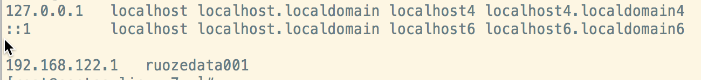
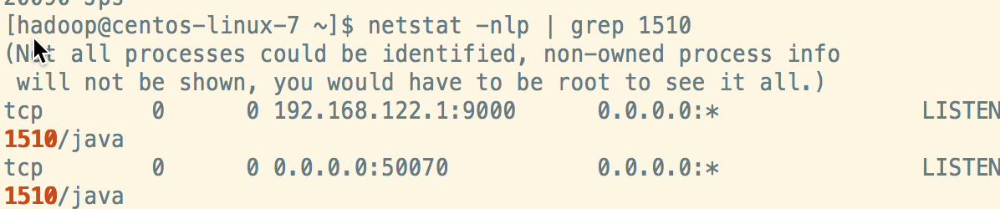

- [Local (Standalone) Mode](http://hadoop.apache.org/docs/r2.10.1/hadoop-project-dist/hadoop-common/SingleCluster.html#Standalone_Operation) 		本地		    1台机器		1个单独的java进程 用于debug
- [Pseudo-Distributed Mode](http://hadoop.apache.org/docs/r2.10.1/hadoop-project-dist/hadoop-common/SingleCluster.html#Pseudo-Distributed_Operation)	   伪分布式	1台机器        多个java进程
- [Fully-Distributed Mode](http://hadoop.apache.org/docs/r2.10.1/hadoop-project-dist/hadoop-common/SingleCluster.html#Fully-Distributed_Operation)  	      集群            多台机器      多个java进程

###### 解压hadoop

解压hadoop到app目录下，并且ln -s 建立软连接

> 软连接的好处就是可以自由的管理hadoop的版本，并不用修改路径

###### 重新覆盖java的路径

edit the file `etc/hadoop/hadoop-env.sh` to define some parameters as follows:

```
  # set to the root of your Java installation
  export JAVA_HOME=/usr/java/latest
```


###### 更改host ip地址为英文名

```
vi /etc/hosts
```



> 注意前两行一定不要删除

然后测试

```
su - hadoop
ssh hadoop@ruozedata001 date
```

配置信任关系

```
rm -rf .ssh
ssh-keygen 三次回车
cd .ssh
```

```
cat ~/.ssh/id_rsa.pub >> ~/.ssh/authorized_keys
chmod 0600 ~/.ssh/authorized_keys 这一步一定不要忘了
ssh hadoop@ruozedata001 date
```

###### Configuration

etc/hadoop/core-site.xml:

```
<configuration>
    <property>
        <name>fs.defaultFS</name>
        <value>hdfs://ruozedata001:9000</value>
    </property>
</configuration>
```

etc/hadoop/hdfs-site.xml:

```
<configuration>
    <property>
        <name>dfs.replication</name>
        <value>1</value>
    </property>
</configuration>
```

etc/hadoop/slaves

```
ruozedata001
```

此处是为了用ruozedata001启动， 能被外网访问， 如果用localhost启动外网访问不了

以使datanode进程启动以ruozedata001启动

Now check that you can ssh to the localhost without a passphrase:

```
$ ssh localhost
```

###### Execution

```
bin/hdfs namenode -format
```

Start NameNode daemon and DataNode daemon:

```
$ sbin/start-dfs.sh
```

更改配置文件etc/hadoop/hdfs-site.xml:

```
<property>
        <name>dfs.namenode.secondary.http-address</name>
        <value>ruozedata001:50090</value>
    </property>
   <property>
        <name>dfs.namenode.secondary.https-address</name>
        <value>ruozedata001:50091</value>
    </property>
```

停止服务

```
sbin/stop-dfs.sh
```

重启服务

最终三个进程才都已ruozedata001启动

使用jps查看

查看namenode进程号

再查看namenode端口号

```
netstat -nlp | grep 进程号
```



使用外部链接 连接namenode 节点

```
http://虚拟机外部ip:50070/dfshealth.html#tab-overview
```

> 此处容易无法链接50070端口，具体解决办法如下

```
先service iptables restart 重新开启

然后service iptables stop 关闭
```

###### 案例

Make the HDFS directories required to execute MapReduce jobs:

```
  $ bin/hdfs dfs -mkdir /user
  $ bin/hdfs dfs -mkdir /user/<username>
```

Copy the input files into the distributed filesystem:

```
  $ bin/hdfs dfs -put etc/hadoop input
```

Run some of the examples provided:

```
$ bin/hadoop jar share/hadoop/mapreduce/hadoop-mapreduce-examples-2.10.1.jar grep input output 'dfs[a-z.]+'
```

>此处目录CDH版本可能和官方版本不同，可以自行在目录下查找

Examine the output files: Copy the output files from the distributed filesystem to the local filesystem and examine them:

```
  $ bin/hdfs dfs -get output output
  $ cat output/*
```

When you’re done, stop the daemons with:

```
  $ sbin/stop-dfs.sh
  sbin/start-dfs.sh
```

###### 问题

数据存储在tmp目录下面，并不合理

因为/tmp目录 30天 不访问的文件夹会被按照规则删除

自定义数据存储目录

在core-site.xml文件中新增

    ```
<property>
  <name>hadoop.tmp.dir</name>
  <value>/home/hadoop/tmp</value>
</property>
    ```

如果启动时遇到namenode无法启动，可以查看log日志

> bin/hadoop namenode -format 格式化后，恢复了默认设置，即可正常启动。

